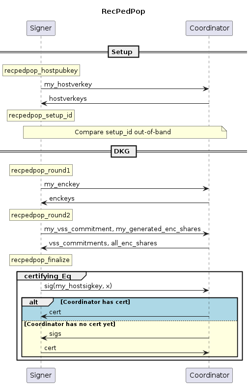

# Distributed Key Generation for FROST (BIP draft)

This document is a work-in-progress Bitcoin Improvement Proposal proposing Distributed Key Generation methods for use in FROST.

## Introduction
In the FROST threshold signature scheme [KG20], a threshold `t` of some set of `n` signers is required to produce a signature.
FROST remains unforgeable even if up to `t-1` signers are compromised,
and remains functional as long as `t` honest signers do not lose their secret key material.

As a result, threshold signatures increase \emph{both} security and availability,
enabling users to escape the inherent dilemma between the contradicting goals of protecting a single secret key against theft and data loss simultaneously.
Before being able to create signatures, the FROST signers need to obtain a shared public key and individual key shares that allow to sign for the shared public key.
This can, in principle, be achieved through a trusted dealer who generates the shared public key and distributes shares of the corresponding secret key to the FROST signers.
However, the dealer is a single point of failure:
if the dealer is malicious or compromised, or the secret key is not deleted correctly and compromised later, an adversary can forge signatures.

An interactive distributed key generation (DKG) protocol run by all signers avoids the need for a trusted dealer.
Assume there are `n` signers and at most `t-1` of them are malicious, i.e., at least `n-t+1` signers are honest.
If a DKG run succeeds from the point of view of an honest signers and outputs a shared public key,
then it is guaranteed that `t` signers are required to cooperate to produce a signature for the shared public key.

There exist a number of DKG protocols with different requirements and guarantees.
Most suitably for the use with FROST is the PedPop DKG (``Pedersen DKG with proofs of possession'') [KG20, CKM21, CGRS23].
But similar to most DKG protocols in the literature, the PedPop DKG has strong requirements on the communication between signers:
It assumes that signers have secure (i.e., authenticated and encrypted) channels between each other to deliver secret shares to individual signers,
and it assumes that signers have access to a secure broadcast mechanism.

This requirements make PedPop difficult to implement correctly in practice, 
and the aim of this document is to describe simple variants of PedPop with "batteries included",
i.e., they incorporate minimal but sufficient implementations of secure channels and secure broadcast.

### Design

Our protocols are based on the SimplPedPop protocol, which has been proven to be secure when combined with FROST [CGRS23] and needs only a single invocation of broadcast.
We first adapt SimplPedPop to a setting with an untrusted coordinator,
which enables bandwidth optimizations and is common also in implementations of the signing stage of FROST.

Our design then follows a layered approach:
We first wrap SimplPedPop in a protocol EncPedPop responsible for encrypting shares.
The encryption relies on pairwise ECDH key exchanges between the signers.

We then wrap EncPedPop in a second protocol RecPedPop that ensures authenticity and implements an equality check protocol, which is a particular abstraction of a broadcast mechanism with restricted functionality. 
Our equality check protocol is an extension of the Goldwasser-Lindell echo broadcast [GW05] protocol
and features "success certificates":
whenever some honest signer considers the DKG to be successful
this honest signer can, ultimately at the time of a signing request, convince all other honest signers that the DKG has indeed been successful.

As an additional feature of RecPedPop, the state of any signing device can be fully recovered from a backup of a single secret per-device seed and the full public transcripts of all the DKG runs in which the device was involved.
RecPedPop thus incorporates solutions for both secure channels and broadcast, and simplifies backups in practice. 

As a result, RecPedPop is our primary recommendation that fits a wide range scenarios, 
and due to its low overhead, we recommend RecPedPop even for applications which already have secure channels or have access to an external broadcast mechanism such as a BFT protocol.
Nevertheless, such applications may wish to use the low-level variants SimplPedPop and EncPedPop in special cases.

|                 | seed              | requires secure channels | requires equality check (broadcast) | backup                      |
|-----------------|-------------------|--------------------------|-------------------------------------|-----------------------------|
| **SimplPedPop** | fresh             | yes                      | yes                                 | share per setup             |
| **EncPedPop**   | reuse allowed     | no                       | yes                                 | share per setup             |
| **RecPedPop**   | reuse for backups | no                       | no                                  | seed + public transcript per setup |

We aim for the following additional design goals:

- **Large Number of Applications**: We wish to support a wide range of scenarios, from those where the signing devices are owned and connected by a single individual, to scenarios where multiple owners manage the devices from distinct locations. Moreover, we wish to support situations where backup information is required to be written down manually, as well as those with ample backup space.
- **DKG outputs per-participant public keys**: When DKG is used in FROST, partial signature verification should be possible.
- **Simple backups**:
- **Support for Coordinator**: As in the FROST signing protocol, we wish to support a coordinator who can relay messages between the peers. This reduces communication overhead, because the coordinator is able to aggregate some some messages. A malicious coordinator can force the DKG to fail but cannot negatively affect the security of the DKG.

TODO Describe and explain non-goals
- **No robustness**: Only very rudimentary ability to identify misbehaving signers in some situations.
<!-- - **Little optimized for communication overhead or number of rounds** -->

### Backup and Recovery

Losing the secret share or the shared public key will render the signer incapable of producing signatures.
These values are the output of the DKG and therefore, cannot be derived from a seed - unlike secret keys in BIP 340 or BIP 327.
In many scenarios, it is highly recommended to have a backup strategy to recover the outputs of the DKG.
The recommended strategies are described in the EncPedPop and RecPedPop Backup and Recovery sections.

There are strategies to recover if the backup is lost and other signers assist in recovering.
In such cases, the recovering signer must be very careful to obtain the correct secret share and shared public key!
1. If all other signers are cooperative and their seed is backed up (EncPedPop or RecPedPop), it's possible that the other signers can recreate the signer's lost secret share.
2. If threshold-many signers are cooperative, they can use the "Enrolment Repairable Threshold Scheme" described in [these slides](https://github.com/chelseakomlo/talks/blob/master/2019-combinatorial-schemes/A_Survey_and_Refinement_of_Repairable_Threshold_Schemes.pdf).
   This scheme requires no additional backup or storage space for the signers.
These strategies are out of scope for this document.

### Preliminaries

#### Notation

All participants agree on an assignment of indices `0` to `n-1` to participants.

* The function `chan_send(m)` sends message `m` to the coordinator.
* The function `chan_receive()` returns the message received by the coordinator.
* The function `chan_receive_from(i)` returns the message received by participant `i`.
* The function `chan_send_to(i, m)` sends message `m` to participant `i`.
* The function `chan_send_all(m)` sends message `m` to all participants.
* The function `secure_chan_send(i, m)` sends message `m` to participant `i` through a secure (encrypted and authenticated) channel.
* The function `secure_chan_receive(i)` returns the message received by participant `i` through a secure (encrypted and authenticated) channel.
* The function `sum_group(group_elements)` performs the group operation on the given elements and returns the result.
* The function `sum_scalar(scalars)` sums scalars modulo `GROUP_ORDER` and returns the result.
* The function `individual_pk(sk)` is identical to the BIP 327 `IndividualPubkey` function.
* The function `verify_sig(pk, m, sig)` is identical to the BIP 340 `Verify` function.
* The function `sign(sk, m)` is identical to the BIP 340 `Sign` function.

```python
def kdf(seed, ...):
    # TODO
```

#### Verifiable Secret Sharing (VSS)

TODO: the functions `secret_share_shard` and `vss_verify` from the irtf spec are a bit clunky to use for us...

```python
# Copied from draft-irtf-cfrg-frost-15
def polynomial_evaluate(x, coeffs):
   value = Scalar(0)
   for coeff in reverse(coeffs):
     value *= x
     value += coeff
   return value

# Copied from draft-irtf-cfrg-frost-15
def secret_share_shard_irtf(s, coefficients, MAX_PARTICIPANTS):
     # Prepend the secret to the coefficients
     coefficients = [s] + coefficients

     # Evaluate the polynomial for each point x=1,...,n
     secret_key_shares = []
     for x_i in range(1, MAX_PARTICIPANTS + 1):
       y_i = polynomial_evaluate(Scalar(x_i), coefficients)
       secret_key_share_i = (x_i, y_i)
       secret_key_shares.append(secret_key_share_i)
     return secret_key_shares, coefficients

def secret_share_shard(coefficients, MAX_PARTICIPANTS):
    # strip coefficients, strip indices
    shares = secret_share_shard_irtf(s, coefficients, MAX_PARTICIPANTS)[0]
    return [pair[0] for pair in shares]

# Copied from draft-irtf-cfrg-frost-15
def vss_commit(coeffs):
     vss_commitment = []
     for coeff in coeffs:
       A_i = G.ScalarBaseMult(coeff)
       vss_commitment.append(A_i)
     return vss_commitment

def vss_sum_commitments(vss_commitments, t):
    # TODO: using "Lloyd's trick", this optimization should be mentioned somewhere
    n = len(vss_commitments)
    assert(all(len(vss_commitment[0]) == t for vss_commitment in vss_commitments)
    # The returned array consists of 2*n + t - 1 elements
    # [vss_commitments[0][0][0], ..., vss_commitments[n-1][0][0],
    #  sum_group(vss_commitments[i][1]), ..., sum_group(vss_commitments[i][t-1]),
    #  vss_commitments[0][1], ..., vss_commitments[n-1][1]]
    return [vss_commitments[i][0][0] for i in range(n)] +
           [sum_group([vss_commitments[i][0][j] for i in range(n)]) for j in range(1, t)] +
           [vss_commitments[i][1] for i in range(n)]

```

<!-- This is not python -->
```
# Copied from draft-irtf-cfrg-frost-15
def vss_verify_irtf(share_i, vss_commitment)
     (i, sk_i) = share_i
     S_i = G.ScalarBaseMult(sk_i)
     S_i' = G.Identity()
     for j in range(0, MIN_PARTICIPANTS):
       S_i' += G.ScalarMult(vss_commitment[j], pow(i, j))
     return S_i == S_i'
```

```python
def vss_verify(my_idx, vss_commitments_sum, shares_sum):
    return vss_verify_irtf((my_idx, shares_sum), vss_commitments_sum)

# Copied from draft-irtf-cfrg-frost-15
def derive_group_info(MAX_PARTICIPANTS, MIN_PARTICIPANTS, vss_commitment)
  PK = vss_commitment[0]
  participant_public_keys = []
  for i in range(1, MAX_PARTICIPANTS+1):
    PK_i = G.Identity()
    for j in range(0, MIN_PARTICIPANTS):
      PK_i += G.ScalarMult(vss_commitment[j], pow(i, j))
    participant_public_keys.append(PK_i)
  return PK, participant_public_keys
```

#### Equality Check

TODO Move the Agreement section here and reorganize it

### DKG Protocols
For each signer, the DKG has three outputs: a secret share, the shared public key, and individual public keys for partial signature verification.
The secret share and shared public key are required by a signer to produce signatures and therefore, signers *must* ensure that they are not lost.
We refer to the [Backup and Recovery](#backup-and-recovery) section for additional details.

<!-- Once the DKG concludes successfully, applications should consider creating a FROST signature with all signers for some test message in order to rule out basic errors in the setup. -->

#### SimplPedPop

We specify the SimplPedPop scheme as described in
[Practical Schnorr Threshold Signatures Without the Algebraic Group Model, section 4](https://eprint.iacr.org/2023/899.pdf)
with the following minor modifications:

- Adding individual's signer public keys to the output of the DKG. This allows partial signature verification.
- Very rudimentary ability to identify misbehaving signers in some situations.
- The proof-of-knowledge in the setup does not commit to the prover's ID. This is slightly simpler because it doesn't require the setup algorithm to take the ID as input.

SimplPedPop requires SECURE point-to-point channels between the participants, i.e., channels that are ENCRYPTED and AUTHENTICATED.
The messages can be relayed through a coordinator who is responsible to pass the messages to the participants as long as the coordinator does not interfere with the secure channels between the participants.

Also, SimplePedPop requires an interactive protocol `Eq` as described in section [Ensuring Agreement](#ensuring-agreement).
While SimplPedPop is able to identify participants who are misbehaving in certain ways, it is easy for a participant to misbehave such that it will not be identified.

In SimplPedPop, the signers designate a coordinator who relays and aggregates messages.
Every participant runs the `simplpedpop` algorithm and the coordinator runs the `simplpedpop_coordinate` algorithm as described below.

```python
def simplpedpop_round1(seed, t, n):
    """
    Start SimplPedPop by generating messages to send to the other participants.

    :param bytes seed: FRESH, UNIFORMLY RANDOM 32-byte string
    :param int t: threshold
    :param int n: number of participants
    :return: a state, a VSS commitment and shares
    """
    coeffs = [kdf(seed, "coeffs", i) for i in range(t)]
    sig = sign(coeffs[0], "")
    # FIXME make sig a separate thing
    my_vss_commitment = (vss_commit(coeffs), sig)
    my_generated_shares = secret_share_shard(coeffs, n):
    state = (t, n)
    return state, my_vss_commitment, my_generated_shares

def simplpedpop_finalize(state, my_idx, vss_commitments_sum, shares_sum, Eq, eta = ()):
    """
    Take the messages received from the participants and finalize the DKG

    :param int my_idx:
    :param List[bytes] vss_commitments_sum: output of running vss_sum_commitments() with vss_commitments from all participants (including this participant) (TODO: not a list of bytes)
    :param scalar shares_sum: summed shares from all participants (including this participant) for this participant mod group order
    :param eta: Optional argument for extra data that goes into `Eq`
    :return: a final share, the shared pubkey, the individual participants' pubkeys
    """
    t, n = state
    assert(len(vss_commitments_sum) == 2*n + t - 1)
    for i in range(n):
        if not verify_sig(vss_commitments_sum[i], "", vss_commitments_sum[n + t-1 + i]):
            raise BadParticipantError(i, "Participant sent invalid proof-of-knowledge")
    eta += (vss_commitments_sum)
    # Strip the signatures and sum the commitments to the constant coefficients
    vss_commitments_sum_coeffs = [sum_group([vss_commitments_sum[i] for i in range(n)])] + vss_commitments_sum[n:n+t-1]
    if not vss_verify(my_idx, vss_commitments_sum_coeffs, shares_sum):
        return False
    if Eq(eta) != SUCCESS:
        return False
    shared_pubkey, signer_pubkeys = derive_group_info(n, t, vss_commitments_sum_coeffs)
    return shares_sum, shared_pubkey, signer_pubkeys

# TODO: We would actually have to parse the received network messages. This
# should include parsing of the group elementsas well as checking that the
# length of the lists is correct (e.g. vss_commitments are of length t) and
# allow to identify bad participants/coordinator instead of running into
# assertions.
def simplpedpop(seed, t, n, my_idx, Eq):
  state, my_vss_commitment, my_generated_shares = simplpedpop_round1(seed, t, n)
  for i in range(n)
      secure_chan_send(i, my_generated_shares[i])
  chan_send(my_vss_commitment)
  shares = []
  for i in range(n):
      shares += [secure_chan_receive(i)]
  vss_commitments_sum = chan_receive()
  return simplpedpop_finalize(state, my_idx, vss_commitments_sum, sum_scalar(shares), Eq, eta = ()):

def simplpedpop_coordinate(t, n):
    vss_commitments = []
    for i in range(n)
        vss_commitments += [chan_receive_from(i)]
    vss_commitments_sum = vss_sum_commitments(vss_commitments, t)
    chan_send_all(vss_commitments_sum)
```

#### EncPedPop

EncPedPop is identical to SimplPedPop except that it does not require secure channels between the participants.
Every EncPedPop participant runs the `encpedpop` algorithm and the coordinator runs the `encpedpop_coordinate` algorithm as described below.

##### Encryption

```python
def ecdh(x, Y, context):
    return Hash(x*Y, context)

def encrypt(share, my_deckey, enckey, context):
    return (share + ecdh(my_deckey, enckey, context)) % GROUP_ORDER
```

#### EncPedPop

The participants start by generating an ephemeral key pair as per [BIP 327's IndividualPubkey](https://github.com/bitcoin/bips/blob/master/bip-0327.mediawiki#key-generation-of-an-individual-signer) for encrypting the 32-byte key shares.

```python
def encpedpop_round1(seed):
    my_deckey = kdf(seed, "deckey")
    my_enckey = individual_pk(my_deckey)
    state1 = (my_deckey, my_enckey)
    return state1, my_enckey
```

The (public) encryption keys are distributed among the participants.

```python
def encpedpop_round2(seed, state1, t, n, enckeys):
    assert(n == len(enckeys))
    if len(enckeys) != len(set(enckeys)):
        raise DuplicateEnckeysError

    my_deckey, my_enckey = state1
    # Protect against reuse of seed in case we previously exported shares
    # encrypted under wrong enckeys.
    seed_ = Hash(seed, t, enckeys)
    simpl_state, vss_commitment, shares = simplpedpop_round1(seed_, t, n)
    enc_context = hash([t] + enckeys)
    enc_shares = [encrypt(shares[i], my_deckey, enckeys[i], enc_context) for i in range(len(enckeys))
    state2 = (t, my_deckey, my_enckey, enckeys, simpl_state)
    return state2, vss_commitment, enc_shares

def encpedpop_finalize(state2, vss_commitments_sum, enc_shares_sum, Eq, eta = ()):
    t, my_deckey, my_enckey, enckeys, simpl_state = state2
    n = len(enckeys)
    assert(len(vss_commitments_sum) == 2*n + t - 1)

    enc_context = hash([t] + enckeys)
    shares_sum = enc_shares_sum - sum_scalar([ecdh(my_deckey, enckeys[i], enc_context) for i in range(n)]
    # TODO: catch "ValueError: not in list" exception
    try:
        my_idx = enckeys.index(my_enckey)
    except ValueError:
        raise BadCoordinatorError("Coordinator sent list of encryption keys that does not contain our key.")
    eta += (enckeys)
    simplpedpop_finalize(simpl_state, my_idx, vss_commitments_sum, shares_sum, Eq, eta):
```

Note that if the public keys are not distributed correctly or the messages have been tampered with, `Eq(eta)` will fail.

```python
def encpedpop(seed, t, n, Eq):
    state1, my_enckey = encpedpop_round1(seed):
    chan_send(my_enckey)
    enckeys = chan_receive()

    state2, my_vss_commitment, my_generenckeys):
    chan_send((my_vss_commitment, my_generated_enc_shares))
    vss_commitments_sum, enc_shares_sum = chan_receive()

    return encpedpop_finalize(state2, vss_commitments_sum, enc_shares_sum, Eq)

# TODO: explain that it's possible to arrive at the global order of signer indices by sorting enckeys

def encpedpop_coordinate_internal(t, n):
    vss_commitments = []
    enc_shares_sum = (0)*n
    for i in range(n)
        vss_commitment, enc_shares = [chan_receive_from(i)]
        vss_commitments += [vss_commitment]
        enc_shares_sum = [ enc_shares_sum[j] + enc_shares[j] for j in range(n) ]
    vss_commitments_sum = vss_sum_commitments(vss_commitments, t)
    return vss_commitments_sum, enc_shares_sum

def encpedpop_coordinate(t, n):
    vss_commitments_sum, enc_shares_sum = encpedpop_coordinate_internal(t, n)
    for i in range(n)
        chan_send_to(i, (vss_commitments_sum, enc_shares_sum[i]))
```

##### Backup and Recovery

There are two possible backup strategies for `EncPedPop`:

1. **Backup of the secret shares**
    Backups consist of the signer index and DKG outputs: secret share and shared public key.
    It is possible to only back up the secret share, but then the shared public key and index needs to be provided to complete a recovery (TODO: what if the public key and index are wrong?).
    This data needs to be backed up for every DKG the signer is involved in.
    The backup needs to be stored securely: anyone obtaining the backup has stolen all the data necessary to create partial signatures just as the victim signer.
2. **Backup of the seed and encrypted shares**
    It is also possible to back up the seed in a secure location and back up the encrypted shares.
    ```python
    # All inputs of this function are required to be backed up for full recovery
    # With the exception of seed, they are public data
    def encpedpop_recover(seed, enc_shares_sum, t, enckeys, shared_pubkey, signer_pubkeys):
        my_deckey = kdf(seed, "deckey")
        enc_context = hash([t] + enckeys)
        shares_sum = enc_shares_sum - sum_scalar([ecdh(my_deckey, enckeys[i], enc_context) for i in range(n)]
        return shares_sum, shared_pubkey, signer_pubkeys

    # my_idx is required for signing
    def encpedpop_recover_my_idx(seed, enc_shares_sum, t, enckeys, shared_pubkey, signer_pubkeys):
        return enckeys.index(my_enckey)
    ```
    If the encrypted shares are lost and all other signers are cooperative and have seed backups, then there is also the possibility to re-run the DKG.

#### RecPedPop

RecPedPop is a wrapper around EncPedPop.
Its advantage is that recovering a signer is securely possible from a single seed and the full transcript of the protocol.
Since the transcript is public, every signer (and the coordinator) can store it to help recover any other signer.

Generate long-term host keys.

```python
def recpedpop_hostpubkey(seed):
    my_hostsigkey = kdf(seed, "hostsigkey")
    my_hostverkey = individual_pk(hostsigkey)
    return (my_hostsigkey, my_hostverkey)
```

The participants send their host pubkey to the other participant and collect received host pubkeys.
They then compute a setup identifier that includes all participants (including yourself TODO: this is maybe obvious but probably good to stress, in particular for backups).

```python
def recpedpop_setup_id(hostverkeys, t, context_string):
    setup_id = Hash(hostverkeys, t, context_string)
    setup = (hostverkeys, t, setup_id)
    return setup, setup_id
```

The participants compare the setup identifier with every other participant out-of-band.
If some other participant presents a different setup identifier, the participant aborts.

```python
def recpedpop_round1(seed, setup):
    hostverkeys, t, setup_id = setup

    # Derive setup-dependent seed
    seed_ = kdf(seed, setup_id)

    enc_state1, my_enckey =  encpedpop_round1(seed_)
    state1 = (hostverkeys, t, setup_id, enc_state1, my_enckey)
    return state1, my_enckey
```

```python
def recpedpop_round2(seed, state1, enckeys):
    hostverkeys, t, setup_id, enc_state1, my_enckey = state1

    enc_state2, vss_commitment, enc_shares = encpedpop_round2(seed_, enc_state1, t, n, enckeys)
    my_idx = enckeys.index(my_enckey)
    state2 = (setup_id, my_idx, enc_state2)
    return state2, hostverkeys, vss_commitment, enc_shares
```

```python
def recpedpop_finalize(seed, state2, vss_commitments_sum, all_enc_shares_sum, Eq):
    (setup_id, my_idx, enc_state2) = state2

    # TODO Not sure if we need to include setup_id as eta here. But it won't hurt.
    # Include the enc_shares in eta to ensure that participants agree on all
    # shares, which in turn ensures that they have the right transcript.
    # TODO This means all parties who hold the "transcript" in the end should
    # participate in Eq?
    eta = (setup_id, all_enc_shares_sum)
    my_enc_shares_sum = all_enc_shares_sum[my_idx]
    return encpedpop_finalize(enc_state2, vss_commitments_sum, my_enc_shares_sum, Eq, eta)
```

```python
def recpedpop(seed, my_hostsigkey, setup):
    state1, my_enckey = recpedpop_round1(seed, setup)
    chan_send(my_enckey)
    enckeys = chan_receive()

    state2, hostverkeys, my_vss_commitment, my_generated_enc_shares =  recpedpop_round2(seed, state1, enckeys)
    chan_send((my_vss_commitment, my_generated_enc_shares))
    vss_commitments, enc_shares_sum = chan_receive()

    shares_sum, shared_pubkey, signer_pubkeys = recpedpop_finalize(seed, state2, vss_commitments_sum, enc_shares_sum, make_certifying_Eq(my_hostsigkey, hostverkeys))
    transcript = (setup, enckeys, vss_commitments_sum, enc_shares_sum, result["cert"])
    return shares_sum, shared_pubkey, signer_pubkeys, transcript

def recpedpop_coordinate(t, n):
    vss_commitments_sum, enc_shares_sum = encpedpop_coordinate_internal(t, n)
    chan_send_all((vss_commitments_sum, enc_shares_sum))
```



##### Backup and Recovery
A `RecPedPop` backup consists of the seed and the DKG transcript.
The seed can be reused for multiple DKGs and must be stored securely.
On the other hand, DKG transcripts are public and allow to re-run above RecPedPop algorithms to obtain the DKG outputs.

```python
# Recovery requires the seed and the public transcript
def recpedpop_recover(seed, transcript):
    my_hostsigkey, _ = recpedpop_hostpubkey(seed)
    setup, enckeys, vss_commitments_sum, enc_shares_sum, cert = transcript

    state1, my_enckey = recpedpop_round1(seed, setup)
    state2, my_vss_commitment, my_generated_enc_shares =  recpedpop_round2(seed, state1, enckeys)

    def Eq(x):
        return verify(hostverkeys, x, cert)
    shares_sum, shared_pubkey, signer_pubkeys = recpedpop_finalize(seed, my_hostsigkey, state2, vss_commitments_sum, enc_shares_sum, Eq)
    return shares_sum, shared_pubkey, signer_pubkeys
```

In contrast to the encrypted shares backup strategy of `EncPedPop`, all the non-seed data that needs to be backed up is the same for all signers. Hence, if a signer loses the backup of the DKG transcript, they can request it from the other signers.

### Ensuring Agreement
TODO: The term agreement is overloaded (used for formal property of Eq and for informal property of DKG). Maybe rename one to consistency? Check the broadcast literature first

A crucial prerequisite for security is that participants reach agreement over the results of the DKG.
Indeed, disagreement may lead to catastrophic failure.
For example, assume that all but one participant believe that DKG has failed and therefore delete their secret key material,
but one participant believes that the DKG has finished successfully and sends funds to the resulting threshold public key.
Then those funds will be lost irrevocably, because, assuming t > 1, the single remaining secret share is not sufficient to produce a signature.

DKG protocols in the cryptographic literature often abstract away from this problem
by assuming that all participants have access to some kind of ideal "reliable broadcast" mechanism, which guarantees that all participants receive the same protocol messages and thereby ensures agreement.
However, it can be hard or even theoretically impossible to realize a reliable broadcast mechanism depending on the specific scenario, e.g., the guarantees provided by the underlying network, and the minimum number of participants assumed to be honest.

The DKG protocols described above work with a similar but slightly weaker abstraction instead.
They assume that participants have access to an equality check mechanism "Eq", i.e.,
a mechanism that asserts that the input values provided to it by all participants are equal.

Eq has the following abstract interface:
Every participant can invoke Eq(x) with an input value x. When Eq returns for a calling participant, it will return SUCCESS or FAIL to the calling participant.
 - SUCCESS means that it is guaranteed that all honest participants agree on the value x (but it may be the case that not all of them have established this fact yet). This means that the DKG was successful and the resulting aggregate key can be used, and the generated secret keys need to be retained.
 - FAIL means that it is guaranteed that no honest participant will output SUCCESS. In that case, the generated secret keys can safely be deleted.

As long as Eq(x) has not returned for some participant, this participant does not know whether all honest participants agree on the value or whether some honest participants have output SUCCESS or will output SUCCESS.
In that case, the DKG was potentially successful.
Other honest participants may believe that it was successful and may assume that the resulting keys can be used.
As a result, even if Eq appears to be stuck, the caller must not assume (e.g., after some timeout) that Eq has failed, and, in particular, must not delete the DKG state.

More formally, Eq must fulfill the following properties:
 - Integrity: If some honest participant outputs SUCCESS, then for every pair of values x and x' input provided by two honest participants, we have x = x'.
 - Consistency: If some honest participant outputs SUCCESS, no other honest participant outputs FAIL.
 - Conditional Termination: If some honest participant outputs SUCCESS, then all other participants will (eventually) output SUCCESS.
<!-- The latter two properties together are equivalent to Agreement in the paper. -->

Optionally, the following property is desired but not always achievable:
 - (Full) Termination: All honest participants will (eventually) output SUCCESS or FAIL.

#### Examples
TODO: Expand these scenarios. Relate them to SUCCESS, FAIL.

Depending on the application scenario, Eq can be implemented by different protocols, some of which involve out-of-band communication:

##### Participants are in a single room
In a scenario where a single user employs multiple signing devices (e.g., hardware wallets) in the same room to establish a threshold setup, every device can simply display its value x (or a hash of x under a collision-resistant hash function) to the user. The user can manually verify the equality of the values by comparing the values shown on all displays, and confirm their equality by providing explicit confirmation to every device, e.g., by pressing a button on every device.

TODO add failure case, specify entire protocol

Similarly, if signing devices are controlled by different organizations in different geographic locations, agents of these organizations can meet in a single room and compare the values.

These "out-of-band" methods can achieve termination (assuming the involved humans proceed with their tasks eventually).

##### Certifying network-based protocol based on Goldwasser-Lindell Echo Broadcast
TODO The hpk should be the id here... clean this up and write something about setup assumptions

In a network-based scenario, where long-term host keys are available, the equality check can be instantiated by the following protocol:

```python
def verify_cert(hostverkeys, x, sigs):
    if len(sigs) != len(hostverkeys):
        return False
    is_valid = [verify_sig(hostverkeys[i], x, sigs[i]) for i in range(hostverkeys)]
    return all(is_valid)

def make_certifying_Eq(my_hostsigkey, hostverkeys, result):
    def certifying_Eq(x):
        chan_send(("SIG", sign(my_hostsigkey, x)))
        sigs = [None] * len(hostverkeys)
        while(True)
            i, ty, msg = chan_receive()
            if ty == "SIG":
                is_valid = verify_sig(hostverkeys[i], x, msg)
                if sigs[i] is None and is_valid:
                    sigs[i] = msg
                elif not is_valid:
                    # The signer `hpk` is either malicious or an honest signer
                    # whose input is not equal to `x`. This means that there is
                    # some malicious signer or that some messages have been
                    # tampered with on the wire. We must not abort, and we could
                    # still output SUCCESS when receiving a cert later, but we
                    # should indicate to the user (logs?) that something went
                    # wrong.)
                if sigs.count(None) == 0:
                    cert = sigs
                    result["cert"] = cert
                    for i in range(n):
                        chan_send(("CERT", cert))
                    return SUCCESS
            if ty == "CERT":
                sigs = msg
                if verify_cert(hostverkeys, x, sigs):
                    result["cert"] = cert
                    for i in range(n):
                        chan_send(("CERT", cert))
                    return SUCCESS
    return certifying_eq

def certifying_Eq_coordinate():
    while(True):
        for i in range(n):
            ty, msg = chan_receive_from(i)
            chan_send_all((i, ty, msg))
```

In practice, the certificate can also be attached to signing requests instead of sending it to every participant after returning SUCCESS.
It may still be helpful to check with other participants out-of-band that they have all arrived at the SUCCESS state. (TODO explain)

Proof. (TODO for footnote?)
Integrity:
Unless a signature has been forged, if some honest participant with input `x` outputs SUCCESS,
then by construction, all other honest participants have sent a signature on `x` and thus received `x` as input.
Conditional Termination:
If some honest participant with input `x` returns SUCCESS,
then by construction, this participant sends a list `cert` of valid signatures on `x` to every other participant.
Consider any honest participant among these other participants.
Assuming a reliable network, this honest participant eventually receives `cert`,
and by integrity, has received `x` as input.
Thus, this honest participant will accept `cert` and return SUCCESS.

##### Consensus protocol
If the participants run a BFT-style consensus protocol (e.g., as part of a federated protocol), they can use consensus to check whether they agree on `x`.

TODO: Explain more here. This can also achieve termination but consensus is hard (e.g., honest majority, network assumptions...)

