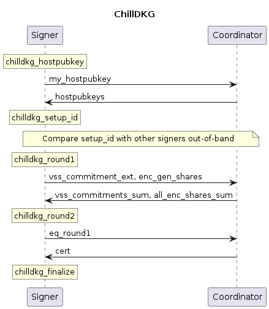

```
BIP:
Title: Distributed Key Generation for FROST
Author: Tim Ruffing <crypto@timruffing.de>
        Jonas Nick <jonas@n-ck.net>
Status: Draft
License: BSD-3-Clause
Type: Informational
Created:
Post-History:
Comments-URI:
```

# Distributed Key Generation for FROST

### Abstract

This Bitcoin Improvement Proposal proposes ChillDKG, a distributed key generation protocol (DKG) for use with the FROST Schnorr threshold signature scheme.

### Copyright

This document is licensed under the 3-clause BSD license.

## Introduction

### Motivation

The FROST signature scheme [[KG20](https://eprint.iacr.org/2020/852),[CKM21](https://eprint.iacr.org/2021/1375),[BTZ21](https://eprint.iacr.org/2022/833),[CGRS23](https://eprint.iacr.org/2023/899)] enables `t`-of-`n` Schnorr threshold signatures,
in which some threshold `t` of a group of `n` participants is required to produce a signature.
FROST remains unforgeable as long as at most `t-1` participants are compromised,
and remains functional as long as `t` honest participants do not lose their secret key material.
Notably, FROST can be made compatible with [BIP340](bip-0340.mediawiki) Schnorr signatures and does not put any restrictions on the choice of `t` and `n` (as long as `1 <= t <= n`).[^t-edge-cases]

[^t-edge-cases]: While `t = n` and `t = 1` are in principle supported, simpler alternatives are available in these cases.
In the case `t = n`, using a dedicated `n`-of-`n` multi-signature scheme such as MuSig2 (see [BIP327](bip-0327.mediawiki)) instead of FROST avoids the need for an interactive DKG.
The case `t = 1` can be realized by letting one participant generate an ordinary [BIP340](bip-0340.mediawiki) key pair and transmitting the key pair to every other participant, who can check its consistency and then simply use the ordinary [BIP340](bip-0340.mediawiki) signing algorithm.
Participants still need to ensure that they agree on key pair. A detailed specification is not in scope of this document.

As a result, threshold signatures increase both security and availability,
enabling users to escape the inherent dilemma between the contradicting goals of protecting a single secret key against theft and data loss simultaneously.
Before being able to create signatures, the participants need to generate a shared *threshold public key* (representing the entire group with its `t`-of-`n` policy),
together with `n` corresponding *secret shares* (held by the `n` participants) that allow to sign under the threshold public key.
This key generation can, in principle, be performed by a trusted dealer who takes care of generating the threshold public key as well as all `n` secret shares,
which are then distributed to the `n` participants via secure channels.
However, the trusted dealer constitutes a single point of failure:
a compromised dealer can forge signatures arbitrarily.

An interactive *distributed key generation* (DKG) protocol session by all participants avoids the need for a trusted dealer.
There exist a number of DKG protocols with different requirements and guarantees in the cryptographic literature.
Most suitably for the use with FROST is the PedPop DKG protocol ("Pedersen DKG [[Ped92](https://doi.org/10.1007/3-540-46766-1_9), [GJKR07](https://doi.org/10.1007/s00145-006-0347-3) with proofs of possession") [[KG20](https://eprint.iacr.org/2020/852),[CKM21](https://eprint.iacr.org/2021/1375),[CGRS23](https://eprint.iacr.org/2023/899)],
which, like FROST, does not impose restrictions on the choice of `t` and `n`.

But similar to most DKG protocols in the literature, PedPop has strong requirements on the communication channels between participants,
which make it difficult to deploy in practice:
First, it assumes that participants have secure (i.e., authenticated and encrypted) channels between each other,
which is necessary to avoid man-in-the-middle attacks and to ensure confidentiality of secret shares when delivering them to individual participants.
Second, PedPop assumes that all participants have access to some external consensus or reliable broadcast mechanism
that ensures they have an identical view of the protocol messages exchanged during DKG.
This will in turn ensure that all participants eventually reach agreement over the results of the DKG,
which include not only parameters such as the generated threshold public key,
but also whether the DKG has succeeded at all.

To understand the necessity of reaching agreement,
consider the example of a DKG to establish `2`-of-`3` Bitcoin wallet,
in which two participants are honest, but the third participant is malicious.
The malicious participant sends invalid secret shares to the first honest participant, but valid shares to the second honest participant.
While the first honest participant cannot finish the DKG,
the second honest participant will believe that the DKG has finished successfully,
and thus may be willing to send funds to the resulting threshold public key.
But this constitutes a catastrophic failure:
Those funds will be lost irrevocably, because the single remaining secret share of the second participant will not be sufficient to produce a signature (without the help of the malicious participant).[^resharing-attack]

[^resharing-attack]: A very similar attack has been observed in the implementation of a resharing scheme [[AS20](https://eprint.iacr.org/2020/1052), Section 3].

To sum up, there is currently no description of PedPop that
does not assume the availability of external secure channels and consensus
and thus can be turned into a standalone implementation.
To overcome these issues, we propose ChillDKG in this BIP.
ChillDKG is a variant of PedPop with "batteries included",
i.e., it incorporates minimal but sufficient implementations of secure channels and consensus
and thus does not have external dependencies.
This makes it easy to implement and deploy, and
we provide detailed algorithmic specifications in form of Python code.

### Design

We assume a network setup in which participants have point-to-point connections to an untrusted coordinator.
This will enable bandwidth optimizations and is common also in implementations of the signing stage of FROST.

TODO long term keys

The basic building block of ChillDKG is the SimplPedPop protocol (a simplified variant of PedPop), which has been proven to be secure when combined with FROST [[CGRS23](https://eprint.iacr.org/2023/899)].
Besides external secure channels, SimplPedPod depends on an external *equality check protocol*.
The equality check protocol serves an abstraction of a consensus mechanism:
Its only purpose is to check that, at the end of SimplPedPod, all participants have received identical protocol messages.

Our goal is to turn SimplPedPop into a standalone DKG protocol without external dependencies.
We then follow a modular approach that removes one dependency at a time.
First, we take care of secure channels by wrapping SimplPedPop in a protocol EncPedPop,
which relies on pairwise ECDH key exchanges between the participants to encrypt secret shares.
Finally, we add a concrete equality check protocol CertEq to EncPedPop to obtain a standalone DKG protocol ChillDKG.

Our equality check protocol CertEq consists of every participant simply collecting a list of valid signatures on the session transcript from all `n` participants
before finalizing the DKG session with some threshold public key as output.
The list of signatures, also called a *success certificate*, can convince any other honest participant
(ultimately at the time of a signing request)
that the DKG session has indeed been successful.
This is sufficient to exclude the catastrophic failure described in the previous section.

TODO Call this restore instead of recovery?
As an additional feature of ChillDKG, the DKG outputs for any signing device can be fully recovered from
a backup of a single secret per-device seed,
the (essential parts) of the public transcripts of the DKG sessions,
and the corresponding success certificates.
To simplify the interface, we combine the transcript data and the session certificate into a single byte string called the *recovery data*,
which is common to all participants and does not need to be kept confidential.
Recovering a device that has participated in a DKG session then requires just the device seed and the recovery data,
the latter of which can be obtained from any cooperative participant (or the coordinator), or from an untrusted backup provider.

These features make ChillDKG usable in a wide range of applications.
As a consequence of this broad applicability, there will necessary be scenarios in which specialized protocols need less communication overhead and fewer rounds,
e.g., when setting up multiple signing devices in a single location.

In summary, we aim for the following design goals:
- **Standalone**: ChillDKG is fully specified, requiring no external secure channels or consensus mechanism.
- **Conditional agreement**: If a ChillDKG session succeeds for one honest participant, this participant will be able to convince every other honest participant that the session has succeeded.
- **No restriction on threshold**:  Like the FROST signing protocol, ChillDKG supports any threshold `t <= n`, including `t > n/2` (also called "dishonest majority").
- **Broad applicability**:  ChillDKG supports a wide range of scenarios, from those where the signing devices are owned and connected by a single individual, to scenarios where multiple owners manage the devices from distinct locations.
- **Simple backups**: The capability of ChillDKG to recover devices from a static seed and public recovery data avoids the need for secret per-session backups, enhancing user experience.
- **Untrusted coordinator**: Like FROST, ChillDKG uses a coordinator that relays messages between the participants. This simplifies the network topology, and the coordinator additionally reduces communication overhead by aggregating some of the messages. A malicious coordinator can force the DKG to fail but cannot negatively affect the security of the DKG.
- **DKG outputs per-participant public keys**: When ChillDKG is used with FROST, partial signature verification is supported.

In summary, ChillDKG incorporates solutions for both secure channels and consensus, and simplifies backups in practice.
As a result, it fits a wide range of application scenarios,
and due to its low overhead, we recommend ChillDKG even secure communication channels or a consensus mechanism (e.g., a BFT protocol or a reliable broadcast mechanism) is readily available.

#### Why Robustness is not a Goal
A direct consequence of the ability to support dishonest majority setups (`t > n/2`) in asynchronous networks is that robustness cannot be guaranteed, i.e., misbehaving participants can prevent the protocol from completing successfully.
TODO footnote
Nevertheless, we believe that this is, in fact, desirable:
A robust DKG protocol that insists on succeeding in the presence of malicious or otherwise faulty signers carries the risk of masking faults, possibly preventing users from investigating and resolving them.

For example, consider a key generation ceremony for a threshold cold wallet intended store large amounts of Bitcoin.
If it turns out that one of the devices participating appears non-responsive, e.g., due to a loss of network or a software bug,
it will typically be desirable to prefer security over progress, and abort instead of forcing successful termination of the ceremony.
Note that all a robust DKG protocol could achieve is to consider that device non-responsive and effectively exclude it from the DKG session, which degrades the setup already from the beginning from `t of n` to `t-1` of `n-1`.
While a warning can be presented to users in this case, it is well known, e.g., from certificate warnings in browsers, that users tend to misunderstand and ignore these.

Even in distributed systems with strict liveness requirements, e.g., a system run by a large federation of nodes of which a majority is trusted, what is typically necessary for the liveness of the system is the continued ability to *produce signatures*.
However, the setup of keys is typically performed in a one-time ceremony at the inception of the system (and possibly repeated in large time intervals, e.g., every few months).
In other words, what is primarily required to ensure liveness in these applications is a robust signing protocol (and a solution for FROST exists [[RRJSS22](https://eprint.iacr.org/2022/550)], and not a robust DKG protocol.

TODO In such cases it is not possible to identify the misbehaving participant (unless they misbehave in certain trivial ways).

### Structure of this Document

TODO say here that we only give high-level descriptions and that the code is the spec

## Internals of ChillDKG

To ease understanding of the interface and reference code of ChillDKG,
we provide a technical overview of the internals ChillDKG, which includes, as building blocks, the DKG protocols SimplPedPop and EncPedPod, and the equality check protocol CertEq.
The contents of this section are informational and not strictly required to implement or use ChillDKG.

We stress that **this document does not endorse the direct use of SimplPedPop or EncPedPod as DKG protocols**.
While SimplPedPop and EncPedPop may in principle serve as building blocks of other DKG protocols (e.g., for applications that already incorporate a consensus mechanism),
this requires careful further consideration, which is not in the scope of this document.
Consequently, implementations should not expose the algorithms of the building blocks as part of a high-level API, which is intended to be safe to use.

Executable specifications of all building blocks are provided as part of the Python reference implementation.

### SimplPedPop

The SimplPedPop scheme has been proposed in
[Practical Schnorr Threshold Signatures Without the Algebraic Group Model, section 4](https://eprint.iacr.org/2023/899.pdf)
as an variant PedPop protocol [], an extension of Pedersen DKG [].
As all variants of Pedersen DKG, SimplPedPop relies on Feldman's Verifiable Secret Sharing (VSS),
which consist of every participant performing Shamir secret sharing of ...
TODO explain
TODO explain that everything is deterministically derived from a seed  (where?)

We make the following modifications as compared to the original SimplPedPop proposal:
- Adding individual's participant public keys to the output of the DKG. This allows partial signature verification.
- The participants send VSS commitments to an untrusted coordinator instead of directly to each other. This lets the coordinator aggregate VSS commitments, which reduces communication cost.
- The proofs of knowledge are not included in the data for the equality check. This will reduce the size of the backups in ChillDKG.

### EncPedPop

EncPedPop is a thin wrapper around that SimplPedPop.
It takes care of encrypting the secret shares,
so that they can be sent over insecure channels.

EncPedPod encrypts the shares to a 33-byte public key
(as generated using [BIP 327's IndividualPubkey](https://github.com/bitcoin/bips/blob/master/bip-0327.mediawiki#key-generation-of-an-individual-participant) algorithm).

### CertEq

As explained in the "Motivation" section, it is crucial for security that participants reach agreement over the results of a DKG session.
EncPedPop (as inherited from SimplPedPop) works with a similar but different abstraction instead:
The last step of a EncPedPod session is to run an external *equality check protocol* Eq,
whose purpose is to verify that all participants have received identical protocol messages during the previous steps.

EncPedPop assumes that Eq is an interactive protocol between the `n` participants with the following abstract interface
(see also TODO):
Every participant can invoke a session of Eq with an input value `x` (TODO and the identities of other participants?).
Eq may not return at all to the calling participant.
But if it returns successfully for some calling participant, then all honest participants agree on the value `x`.
(but it may be the case that not all of them have established this fact yet).
This means that the EncPedPod session was successful and the resulting threshold public key can be returned to the participant, who can use it (e.g., send funds to it).

More formally, Eq must fulfill the following properties:
 - Integrity: If Eq returns successfully to some honest participant, then for every pair of input values x and x' provided by two honest participants, we have `x = x'`.
 - Conditional Agreement: If Eq returns successfully to some honest participant, and all messages between honest participants are delivered eventually, then Eq will eventually return successfully to all honest participants.

Depending on the application scenario, different approaches may be suitable to implement Eq,
e.g., a consensus protocol already available as part of a federated system,
or out-of-band communication such as the user comparing screens of multiple signing devices).[^out-of-band-eq]

[^out-of-band-eq]: For example, in a scenario where a single user employs multiple signing devices (e.g., hardware wallets) in the same room to establish a threshold setup,
every device can simply display its value x (or a hash of x under a collision-resistant hash function) to the user.
The user can manually verify the equality of the values by comparing the values shown on all displays,
and confirm their equality by providing explicit confirmation to every device, e.g., by pressing a button on every device.
Similarly, if signing devices are controlled by different organizations in different geographic locations,
agents of these organizations can meet in a single room and compare the values.
These "out-of-band" methods can achieve conditional agreement (assuming the involved humans proceed with their tasks eventually)
but a detailed treatment is out of scope.

For ChillDKG, we will use a more direct approach.
ChillDKG incorporates an equality check protocol CertEq, which is applicable to network-based scenarios where long-term cryptographic identities of the participants are available.
Concretely, each participant is assumed to hold a long-term key pair of a signature scheme, called the *host key pair*, the public key of which has been verified out-of-band by all other participants.

The CertEq protocol is straightforward:[^certeq-literature]
Every participant sends a signature of their input value `x` to every other participant (via the untrusted coordinator),
and expects to receive valid `x` from all remaining `n-1` participants.
A participant terminates successfully as soon as the participant has collected signatures from all `n` participants (including themselves),
which verify under the message `x` and the respective host public key.
TODO This can be optimized using a multi-signature.

[^certeq-literature]: CertEq can be viewed as signed variant of the Goldwasser-Lindell echo broadcast protocol [[GL05](https://eprint.iacr.org/2002/040), Protocol 1], or alternatively, as a unanimous variant of Signed Echo Broadcast [[Rei94](https://doi.org/10.1145/191177.191194), Section 4], [[GGR11](https://doi.org/10.1007/978-3-642-15260-3), Algorithm 3.17].)

This termination rule immediately implies the integrity property:
Unless a signature has been forged, if some honest participant with input `x` terminates successfully,
then by construction, all other honest participants have sent a signature on `x` and thus received `x` as input.

The key insight to ensuring conditional agreement is that any participant terminating successfully can build a *success certificate* consisting of the collected list of all `n` signatures on `x`.
This certificate will be enough to convince every other honest participant (who, by integrity, has received `x` as input) to terminate successfully
This works at any time in the future, even if this other honest participant has seen received invalid or no signatures during the actual run of CertEq,
due to unreliable networks or an unreliable coordinator, or malicious participants signing more than one value.

Thus, the certificate does not need to be sent during a normal run of CertEq,
but can instead be presented to other participants later,
e.g., during a request to participate in a FROST signing session.

The obvious drawback of this simple protocol is that it does not provide robustness, i.e., it does not guarantee termination in the presence of malicious participants.
any malicious participant (or the coordinator) can, for example, simply refuse to present a signature and stall thereby stall the protocol.

TODO Add note about multisigs/aggsigs

(TODO move to footnote or code comments?)
This protocol satisfies integrity and conditional agreement.
Proof.
Integrity:
Unless a signature has been forged, if some honest participant with input `x` outputs True,
then by construction, all other honest participants have sent a signature on `x` and thus received `x` as input.
Conditional Agreement:
If some honest participant with input `x` returns True,
then by construction, this participant sends a list `cert` of valid signatures on `x` to every other participant.
Consider any honest participant among these other participants.
Assuming a reliable network, this honest participant eventually receives `cert`,
and by integrity, has received `x` as input.
Thus, this honest participant will accept `cert` and return True.

### Putting it all together: ChillDKG

TODO ChillDKG a wrapper around encpedpop, it adds a recovery mechanism

## Usage of ChillDKG

The purpose of this section is to provide a high-level overview of the interface and usage of ChillDKG,
aimed at developers who would like to use a ChillDKG implementation in their applications and systems.

### Use ChillDKG only for FROST
ChillDKG is designed for usage with the FROST Schnorr signature scheme,
and its security depends on specifics of FROST.
We stress that ChillDKG is not a general-purpose DKG protocol [^no-simulatable-dkg],
and combining it with other threshold cryptographic schemes,
e.g., threshold signature schemes other than FROST, or threshold decryption schemes
requires careful further consideration, which is not endorsed or in the scope of this document.

[^no-simulatable-dkg]: As a variant of Pedersen DKG, ChillDKG does not provide simulation-based security [GJKR07](https://doi.org/10.1007/s00145-006-0347-3). Roughly speaking, if ChillDKG is combined with some threshold cryptographic scheme, the security of the combination is not automatically implied by the security of the two components. Instead, the security of every combination must be analyzed separately. The security of the specific combination of SimplPedPop (as core building block of ChillDKG) and FROST has been analyzed [CGRS23](https://eprint.iacr.org/2023/899).

We provide a full Python 3 reference implementation of ChillDKG and its building blocks in [reference/chilldkg.py](reference/chilldkg.py).
Detailed interface documentation of the implementation is also provided in form of Python docstrings in the reference implementation.
Developers, who would like to understand ChillDKG's internals or reference implementation, or implement ChillDKG itself,
should also read [Section "Internals of ChillDKG"](#internals-of-chilldkg).

### Protocol Roles and Network Setup

There are `n >= 2` *participants*, `t` of which will be required to produce a signature.
Each participant has a point-to-point communication link to the *coordinator*
(but participants do not have direct communication links to each other).

If there is no dedicated coordinator, one of the participants can act as the coordinator.
(TODO This is like in MuSig, but we explained this differently in BIP327 where we say that the coordinator is optional...)

### Inputs and Output

TODO inputs

If a session of the DKG protocol returns an output to an (honest) participant,
then we say that this participant *deems the protocol session successful*.
In that case, the output returned by the protocol session to the participant is a tuple consisting of a *secret share* (individual to the participant), the *threshold public key* (common to all participants), a list of n *public shares* for partial signature verification (common to all participants), and *recovery data* (common to all participants).

### Threat Model and Security Goals

Some participants, the coordinator, and all network links may be malicious, i.e., controlled by an attacker.
We expect ChillDKG to provide the following informal security goals when it is used to setup keys for the FROST threshold signature scheme.[^formal-treatment]

[^formal-treatment]: See the paper by Chu, Gerhart, Ruffing, Schröder [CGRS23](https://eprint.iacr.org/2023/899) for more formal treatment.

If a participant deems a protocol session successful (see above), then this participant is assured that:
 - A coalition of at most `t - 1` malicious participants and a malicious coordinator cannot forge signatures under that shared public key. (Unforgeability)
 - All honest participants who deem the protocol session successful will have correct and consistent protocol outputs.
   In particular, they agree the threshold public key, the list of public shares, and the recovery data.
   Moreover, any `t` of them have secret shares consistent with the threshold public key.[^consistent-secret-shares]
   This means that any `t` of have all the necessary inputs to session a successful FROST signing sessions that produce signatures valid under the shared public key.
 - The success certificate will, when presented to any other (honest) participant, convince that other participant to deem the protocol successful.

[^consistent-secret-shares]: The secret shares of any `t` honest participants are, in principle, sufficient to reconstruct the full secret key corresponding to the threshold public key.
However, the very purpose of a threshold signature scheme is to avoid the reconstruction of the full secret key in a single place.

We stress that the mere fact one participant deems a protocol session successful does not imply that other participants deem it successful yet.
Indeed, due to failing network links or invalid messages sent by malicious participants,
it is possible that some participants have deemed the ChillDKG session successful, but others have not (yet) and thus are stuck in the ChillDKG session.\
In that case, the successful participants can eventually make the stuck participants unstuck
by presenting them the recovery data.
The recovery data can, e.g., be attached to the first request to initiate a FROST signing session.

TODO: consider mentioning ROAST

### Steps of a ChillDKG Session

Generate long-term host keys.

```python
chilldkg_hostkey_gen(seed: bytes) -> Tuple[bytes, bytes]
```

To initiate a ChillDKG session,
the participants send their host pubkey to all other participants and collect received host pubkeys.
We assume that the participants agree on the list of host pubkeys (including their order).
If they do not agree, the comparison of the session parameter identifier in the next protocol step will simply fail.
TODO: Params are the (ordered) list of host pubkeys (representing the participants) and threshold `t`.

They then compute a session parameter identifier that includes all participants (including yourself TODO: this is maybe obvious but probably good to stress, in particular for backups).

```python
SessionParams = Tuple[List[bytes], int, bytes]

chilldkg_session_params(hostpubkeys: List[bytes], t: int, context_string: bytes) -> Tuple[SessionParams, bytes]
```

The participants compare the session parameters identifier with every other participant out-of-band.
If a participant is presented a session parameters identifier that does not match the locally computed session parameters identifier, the participant aborts.
Only if all other `n-1` session parameters identifiers are identical to the locally computed session parameters identifier, the participant proceeds with the protocol.

```python
ChillDKGStateR1 = Tuple[SessionParams, int, EncPedPopR1State]

chilldkg_round1(seed: bytes, params: SessionParams) -> Tuple[ChillDKGStateR1, VSSCommitmentExt, List[Scalar]]
```

```python
ChillDKGStateR2 = Tuple[SessionParams, bytes, DKGOutput]

chilldkg_round2(seed: bytes, state1: ChillDKGStateR1, vss_commitments_sum: VSSCommitmentSumExt, all_enc_shares_sum: List[Scalar]) -> Tuple[ChillDKGStateR2, bytes]

```

A return value of False means that `cert` is not a valid certificate.

TODO: the following isn't necessary anymore, since state2 can be recovered with the recovery data.
You MUST NOT delete `state2` in this case.
The reason is that some other participant may have a valid certificate and thus deem the DKG session successful.
That other participant will rely on us not having deleted `state2`.
Once you obtain that valid certificate, you can call `chilldkg_finalize` again with that certificate.

```python
chilldkg_finalize(state2: ChillDKGStateR2, cert: bytes) -> Union[DKGOutput, Literal[False]]
```

### Full DKG Session



TODO Write

TODO Does it make sense to keep these function signatures?

``` python
chilldkg(chan: ParticipantChannel, seed: bytes, my_hostseckey: bytes, params: SessionParams) -> Union[Tuple[DKGOutput, Any], Literal[False]]
```

```python
chilldkg_coordinate(chans: CoordinatorChannels, params: SessionParams) -> Union[GroupInfo, Literal[False]]
```


### Backup and Recovery
Losing the secret share or the shared public key will render the participant incapable of participating in signing sessions.
As these values depend on the contributions of the other participants to the DKG, they can, unlike secret keys in BIP 340 or BIP 327, not be derived solely from the participant's seed.

To facilitate backups of a DKG session,
ChillDKG offers the possibility to recover a participant's outputs of the session from the participant's seed and the DKG transcript of the specific session.
As a result, a full backup of a participant consists of the seed and the transcripts of all DKGs sessions the participant has participated in.
(TODO Which sessions? Probably all sessions deemed successful, i.e., the backup should be exported as part of `finalize`.)
Since the transcript is verifiable and the same for all participants,
if a participant loses the backup of the transcript of the DKG session,
they can request it from any other participants or the coordinator.
Moreover, since the transcript contains secret shares only in encrypted form,
it can in principle be stored with a third-party backup provider.
(TODO: But there are privacy implications. The hostpubkeys and shared public key can be inferred from the transcript. We could encrypt the full transcript to everyone... We'd only need to encrypt a symmetric key to everyone.)

```python
chilldkg_backup(state2: ChillDKGStateR2, cert: bytes) -> Any
```

```python
chilldkg_recover(seed: bytes, backup: Any, context_string: bytes) -> Union[Tuple[DKGOutput, SessionParams], Literal[False]]
```

Note that it may not be an unreasonable strategy in a threshold setup not to perform backups of participants at all,
and simply hope that `t` honest and working participants will remain available.
As soon as one or more participants are lost or broken, new DKG session can be performed with the unavailable participants replaced.
One drawback of this method is that it will result in a change of the shared public key,
and the application will, therefore, need to transition to the new shared public key
(e.g., funds stored under the current shared public key need to be transferred to the new key).

Whether to perform backups and how to manage them ultimately depends on the requirements of the application,
and we believe that a general recommendation is not useful.


TODO: make the following a footnote
There are strategies to recover if the backup is lost and other participants assist in recovering.
In such cases, the recovering participant must be very careful to obtain the correct secret share and shared public key!
1. If all other participants are cooperative and their seed is backed up (EncPedPop or ChillDKG), it's possible that the other participants can recreate the participant's lost secret share by running the DKG protocol again.
2. If threshold-many participants are cooperative, they can use the "Enrolment Repairable Threshold Scheme" described in [these slides](https://github.com/chelseakomlo/talks/blob/master/2019-combinatorial-schemes/A_Survey_and_Refinement_of_Repairable_Threshold_Schemes.pdf).
   This scheme requires no additional backup or storage space for the participants.
These strategies are out of scope for this document.
