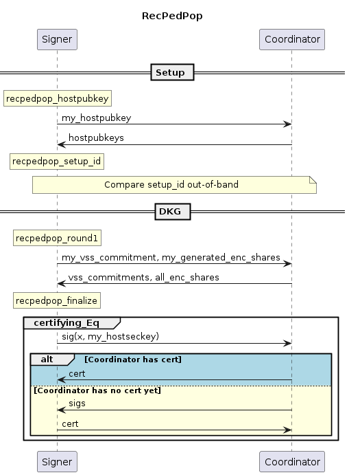

# Distributed Key Generation for FROST (BIP draft)

### Abstract

This document is a work-in-progress Bitcoin Improvement Proposal proposing Distributed Key Generation methods for use in FROST.

### Copyright

This document is licensed under the 3-clause BSD license.

## Introduction

### Motivation

In the FROST threshold signature scheme [KG20], a threshold `t` of some set of `n` signers is required to produce a signature.
FROST remains unforgeable as long as at most `t-1` signers are compromised,
and remains functional as long as `t` honest signers do not lose their secret key material.

As a result, threshold signatures increase both security and availability,
enabling users to escape the inherent dilemma between the contradicting goals of protecting a single secret key against theft and data loss simultaneously.
Before being able to create signatures, the FROST signers need to obtain a shared public key and individual key shares that allow to sign for the shared public key.
This can, in principle, be achieved through a trusted dealer who generates the shared public key and distributes shares of the corresponding secret key to the FROST signers.
However, the dealer is a single point of failure:
if the dealer is malicious or compromised, or the secret key is not deleted correctly and compromised later, an adversary can forge signatures.

An interactive *distributed key generation* (DKG) protocol run by all signers avoids the need for a trusted dealer.
There exist a number of DKG protocols with different requirements and guarantees.
Most suitably for the use with FROST is the PedPop DKG (``Pedersen DKG with proofs of possession'') [KG20, CKM21, CGRS23].
But similar to most DKG protocols in the literature, PedPop has strong requirements on the communication between participants,
which make it difficult to deploy PedPop in practice.
It assumes that signers have secure (i.e., authenticated and encrypted) channels between each other to deliver secret shares to individual signers,
and it assumes that signers have access to a secure broadcast mechanism.
 - TODO Explain how funds are lost if broadcast doesn't work.

The aim of this document is to describe *ChillDKG*, a variant of PedPop with "batteries included",
i.e., it incorporates minimal but sufficient implementations of secure channels and secure broadcast
and thus is easy to deploy in practice.

### Design

The basic building block of our DKG protocol is the SimplPedPop protocol, which has been proven to be secure when combined with FROST [CGRS23].
The variant of SimplPedPop considered here is tailored for scenarios involving an untrusted coordinator, which enables bandwidth optimizations and is common also in implementations of the signing stage of FROST.

TODO: Say something about dishonest majority here, not only in the list below.

Besides external secure channels, SimplPedPod depends on an external *equality check protocol*.
The equality check protocol serves an abstraction of a secure broadcast mechanism with limited functionality (TODO: this may be a confusing way to introduce the realtionship between equality check and broadcast. E.g., it doesn't only have limited functionality, it has more functionality as in broadcast only a single party broadcasts):
Its only purpose is to check that, at the end of SimplPedPod, all participants have established an identical protocol transcript.

Our goal is to turn SimplPedPop into a standalone DKG protocol without external dependencies.
We follow a modular approach that removes one dependency at a time.
First, we take care of secure channels by wrapping SimplPedPop in a protocol EncPedPop,
which relies on pairwise ECDH key exchanges between the participants to encrypt secret shares.
Finally, we add a concrete equality check protocol to EncPedPop to obtain a standalone DKG protocol ChillDKG.

Our equality check protocol is inspired by the Goldwasser-Lindell echo broadcast [GW05] protocol.
Crucially, it ensures that
whenever some participant obtains a threshold public key as output of a successful DKG run,
this honest participant will additionally obtain a transferable "success certificate",
which can convince all other honest participants
(ultimately at the time of a signing request)
that the DKG has indeed been successful.
This is sufficient to exclude the bad scenario described in the previous section. (TODO)

As an additional feature of ChillDKG, the state of any signing device can be fully recovered from a backup of a single secret per-device seed and the full public transcripts of all the DKG runs in which the device was involved.
ChillDKG thus incorporates solutions for both secure channels and broadcast, and simplifies backups in practice.

In summary, ChillDKG fits a wide range of usage scenarios,
and due to its low overhead, we recommend ChillDKG even for applications which already incorporate secure channels or an existing broadcast mechanism such as a BFT protocol.


TODO: We could also mention (conditional) agreement and that it prevents losing coins, because it may not be a property supported by all DKGs. Also could mention "Modularity" since it's possible to wrap SimplPedPop in some other protocol.

In summary, we aim for the following design goals:

- **Standalone**: ChillDKG is fully specified, requiring no pre-existing secure channels or a broadcast mechanism.
- **Dishonest Majority**:  ChillDKG supports any threshold `t <= n` (including "dishonest majority" `t > n/2`).
- **Flexibility**:  ChillDKG supports a wide range of scenarios, from those where the signing devices are owned and connected by a single individual, to scenarios where multiple owners manage the devices from distinct locations.
- **Simple backups**: The capability of ChillDKG to recover from a static seed and public per-setup data impacts the user experience when backing up threshold-signature wallets. This can enhance the probability of having backups available, preventing users from losing access to their wallets.
- **Support for Coordinator**: Like the FROST signing protocol, ChillDKG supports a coordinator who can relay messages between the participants. This reduces communication overhead, because the coordinator is able to aggregate some some messages. A malicious coordinator can force the DKG to fail but cannot negatively affect the security of the DKG.
- **DKG outputs per-participant public keys**: When ChillDKG is used with FROST, partial signature verification is supported.

As a consequence of these design goals, ChillDKG inherit the following limitations:

- **No robustness**: Misbehaving signers can prevent the protocol from completing successfully. In such cases it is not possible to identify who of the signers misbehaved (unless they misbehave in certain trivial ways).
- **Communication complexity not optimal in all scenarios**: While ChillDKG is optimized for bandwidth efficiency and number of rounds under the premise of flexibility, there are conceivable scenarios where specialized protocols may have better communication complexity, e.g., when setting up multiple signing devices in a single location.

## Preliminaries

### Protocol Setup

There are `n >= 2` *signers*, `t` of which will be required to produce a signature.
Each signer has a point-to-point communication link to the *aggregator*
(but signers do not have direct communication links to each other).

If there is no dedicated aggregator, one of the signers can act as the aggregator.
(TODO This is like in MuSig, but we explained this differently in BIP327 where we say that the aggregator is optional...)

### Threat Model and Security Goals

Some signers, the aggregator and all network links may be malicious, i.e., controlled by an attacker.
We expect ChillDKG to provide the following informal security goals when it is used to setup keys for the FROST threshold signature scheme.
(See TODO for a more formal treatment.)

If a run of the DKG protocol returns an output to an (honest) signer,
then we say that this signer *deems the protocol run successful*.
In that case, the output returned by the protocol run to the signer is a tuple consisting of a *secret share* (individual to the signer), the *shared public key* (common to all signers), a list of n *individual public keys* for partial signature verification (common to all signers), and a *success certificate* (common to all signers).

If a signer deems a protocol run successful, then this signer is assured that:
 - A coalition of a malicious aggregator and at most `t - 1` malicious signers cannot forge signatures under that shared public key. (Unforgeability)
 - All (honest) signers who deem the protocol run successful will have correct and consistent protocol outputs.
   In particular, they agree on the shared public key, the list of individual public keys and the success certificate.
   Moreover, any `t` of them have secret shares which are, in principle, sufficient to reconstruct the secret key corresponding to the shared public key.
   This means that any `t` of have all the necessary inputs to run a successful FROST signing sessions that produce signatures valid under the shared public key.
 - The success certificate will, when presented to any other (honest) signer, convince that other signer to deem the protocol successful.

We stress that the mere fact one signer deems a protocol run successful does not imply that other signers deem it successful yet.
That is exactly why the success certificate is necessary:
If some signers have deemed the protocol not successful, but others have not (yet) and thus are stuck in the protocol run,
e.g., due to failing network links or invalid messages sent by malicious signers,
the successful signers can eventually make the stuck signers unstuck
by presenting them a success certificate.
The success certificate can, e.g., be attached to a request to initiate a FROST signing session.

### Notation

We assume the participants agree on an assignment of indices `0` to `n-1` to participants.

* The function `chan_send(m)` sends message `m` to the coordinator.
* The function `chan_receive()` returns the message received by the coordinator.
* The function `chan_receive_from(i)` returns the message received by participant `i`.
* The function `chan_send_all(m)` sends message `m` to all participants.
* The function `point_add_multi(points)` performs the group operation on the given points and returns the result.
* The function `scalar_add_multi(scalars)` sums scalars modulo `GROUP_ORDER` and returns the result.
* The function `pubkey_gen(sk)` is identical to the BIP 327 `IndividualPubkey` function.
* The function `verify_sig(m, pk, sig)` is identical to the BIP 340 `Verify` function.
* The function `sign(m, sk)` is identical to the BIP 340 `Sign` function.

```python
biptag = "BIP DKG: "

def tagged_hash_bip_dkg(tag: str, msg: bytes) -> bytes:
    return tagged_hash(biptag + tag, msg)

def kdf(seed: bytes, tag: str, extra_input: bytes = b'') -> bytes:
    # TODO: consider different KDF
    return tagged_hash_bip_dkg(tag + "KDF ", seed + extra_input)
```

### Verifiable Secret Sharing (VSS)

```python
# A scalar is represented by an integer modulo GROUP_ORDER
Scalar = int

# A polynomial of degree t - 1 is represented by a list of t coefficients
# f(x) = a[0] + ... + a[t] * x^n
Polynomial = List[Scalar]

# Evaluates polynomial f at x
def polynomial_evaluate(f: Polynomial, x: Scalar) -> Scalar:
   value = 0
   # Reverse coefficients to compute evaluation via Horner's method
   for coeff in f[::-1]:
        value = (value * x) % GROUP_ORDER
        value = (value + coeff) % GROUP_ORDER
   return value

# Returns [f(1), ..., f(n)] for polynomial f with coefficients coeffs
def secret_share_shard(f: Polynomial, n: int) -> List[Scalar]:
    return [polynomial_evaluate(f, x_i) for x_i in range(1, n + 1)]
```

```python
# A VSS Commitment is a list of points
VSSCommitment = List[Optional[Point]]

# Returns commitments to the coefficients of f
def vss_commit(f: Polynomial) -> VSSCommitment:
    vss_commitment = []
    for coeff in f:
        A_i = point_mul(G, coeff)
        vss_commitment.append(A_i)
    return vss_commitment

def vss_verify(signer_idx: int, share: Scalar, vss_commitment: VSSCommitment) -> bool:
    P = point_mul(G, share)
    Q = [point_mul(vss_commitment[j], pow(signer_idx + 1, j) % GROUP_ORDER) \
         for j in range(0, len(vss_commitment))]
    return P == point_add_multi(Q)

# An extended VSS Commitment is a VSS commitment with a proof of knowledge
VSSCommitmentExt = Tuple[VSSCommitment, bytes]

# A VSS Commitment Sum is the sum of multiple VSS Commitment PoKs
VSSCommitmentSum = Tuple[List[Optional[Point]], List[bytes]]

def serialize_vss_commitment_sum(vss_commitment_sum: VSSCommitmentSum)-> bytes:
    return b''.join([cbytes_ext(P) for P in vss_commitment_sum[0]]) + b''.join(vss_commitment_sum[1])

# Sum the commitments to the i-th coefficients from the given vss_commitments
# for i > 0. This procedure is introduced by Pedersen in section 5.1 of
# 'Non-Interactive and Information-Theoretic Secure Verifiable Secret Sharing'.
def vss_sum_commitments(vss_commitments: List[VSSCommitmentExt], t: int) -> VSSCommitmentSum:
    n = len(vss_commitments)
    assert(all(len(vss_commitment[0]) == t for vss_commitment in vss_commitments))
    first_coefficients = [vss_commitments[i][0][0] for i in range(n)]
    remaining_coeffs_sum = [point_add_multi([vss_commitments[i][0][j] for i in range(n)]) for j in range(1, t)]
    poks = [vss_commitments[i][1] for i in range(n)]
    return (first_coefficients + remaining_coeffs_sum, poks)

# Outputs the shared public key and individual public keys of the participants
def derive_group_info(vss_commitment: VSSCommitment, n: int, t: int) -> Tuple[Optional[Point], List[Optional[Point]]]:
  pk = vss_commitment[0]
  participant_public_keys = []
  for signer_idx in range(0, n):
    pk_i = point_add_multi([point_mul(vss_commitment[j], pow(signer_idx + 1, j) % GROUP_ORDER) \
                            for j in range(0, len(vss_commitment))])
    participant_public_keys += [pk_i]
  return pk, participant_public_keys
```

## Building Blocks

As a result of our modular design approach, we give detailed algorithmic descriptions of the low-level building blocks SimplPedPop and EncPedPod.
Nevertheless, this is not meant to endorse the direct use of SimplPedPop or EncPedPod as DKGs.
While these may in principle serve as building blocks for other DKG designs (e.g., for applications that already incorporate a broadcast mechanism), this requires careful further consideration, which is not in the scope of this document.

### SimplPedPop

The SimplPedPop scheme has been proposed in
[Practical Schnorr Threshold Signatures Without the Algebraic Group Model, section 4](https://eprint.iacr.org/2023/899.pdf).
We make the following modifications as compared to the original proposal:
- Adding individual's signer public keys to the output of the DKG. This allows partial signature verification.
- The participants send VSS commitments to an untrusted coordinator instead of directly to each other. This lets the coordinator aggregate VSS commitments, which reduces communication cost.
- TODO: removed Eq check, MUST happen afterwards

```python
SimplPedPopR1State = Tuple[int, int, int]
VSS_PoK_msg = (biptag + "VSS PoK").encode()

def simplpedpop_round1(seed: bytes, t: int, n: int, my_idx: int) -> Tuple[SimplPedPopR1State, VSSCommitmentExt, List[Scalar]]:
    """
    Start SimplPedPop by generating messages to send to the other participants.

    :param bytes seed: FRESH, UNIFORMLY RANDOM 32-byte string
    :param int t: threshold
    :param int n: number of participants
    :param int my_idx:
    :return: a state, a VSS commitment and shares
    """
    assert(t < 2**(4*8))
    coeffs = [int_from_bytes(kdf(seed, "coeffs", i.to_bytes(4, byteorder="big"))) % GROUP_ORDER for i in range(t)]
    # TODO: fix aux_rand
    assert(my_idx < 2**(4*8))
    sig = schnorr_sign(VSS_PoK_msg + my_idx.to_bytes(4, byteorder="big"), bytes_from_int(coeffs[0]), kdf(seed, "VSS PoK"))
    vss_commitment_ext = (vss_commit(coeffs), sig)
    gen_shares = secret_share_shard(coeffs, n)
    state = (t, n, my_idx)
    return state, vss_commitment_ext, gen_shares

DKGOutput = Tuple[Scalar, Optional[Point], List[Optional[Point]]]

def simplpedpop_pre_finalize(state: SimplPedPopR1State,
                         vss_commitments_sum: VSSCommitmentSum, shares_sum: Scalar) \
                         -> Tuple[bytes, DKGOutput]:
    """
    Take the messages received from the participants and pre_finalize the DKG

    :param List[bytes] vss_commitments_sum: output of running vss_sum_commitments() with vss_commitments from all participants (including this participant) (TODO: not a list of bytes)
    :param vss_commitments_sum: TODO
    :param scalar shares_sum: sum of shares received by all participants (including this participant) for this participant mod group order
    :param eta: Optional argument for extra data that goes into `Eq`
    :return: a final share, the shared pubkey, the individual participants' pubkeys
    """
    t, n, my_idx = state
    assert(len(vss_commitments_sum) == 2)
    assert(len(vss_commitments_sum[0]) == n + t - 1)
    assert(len(vss_commitments_sum[1]) == n)

    for i in range(n):
        P_i = vss_commitments_sum[0][i]
        if P_i is None:
            raise InvalidContributionError(i, "Participant sent invalid commitment")
        else:
            pk_i = xbytes(P_i)
            if not schnorr_verify(VSS_PoK_msg + i.to_bytes(4, byteorder="big"), pk_i, vss_commitments_sum[1][i]):
                raise InvalidContributionError(i, "Participant sent invalid proof-of-knowledge")
    # TODO: also add t, n to eta?
    eta = serialize_vss_commitment_sum(vss_commitments_sum)
    # Strip the signatures and sum the commitments to the constant coefficients
    vss_commitments_sum_coeffs = [point_add_multi([vss_commitments_sum[0][i] for i in range(n)])] + vss_commitments_sum[0][n:n+t-1]
    if not vss_verify(my_idx, shares_sum, vss_commitments_sum_coeffs):
        raise VSSVerifyError()
    shared_pubkey, signer_pubkeys = derive_group_info(vss_commitments_sum_coeffs, n, t)
    return eta, (shares_sum, shared_pubkey, signer_pubkeys)
```

### EncPedPop

EncPedPop is identical to SimplPedPop except that it does not require secure channels between the participants.
Every EncPedPop participant runs the `encpedpop` algorithm and the coordinator runs the `encpedpop_coordinate` algorithm as described below.

#### Encryption

```python
def ecdh(deckey: bytes, enckey: bytes, context: bytes) -> Scalar:
    x = int_from_bytes(deckey)
    assert(x != 0)
    Y = cpoint(enckey)
    Z = point_mul(Y, x)
    assert Z is not None
    return int_from_bytes(tagged_hash_bip_dkg("ECDH", cbytes(Z) + context))

def encrypt(share: Scalar, my_deckey: bytes, enckey: bytes, context: bytes) -> Scalar:
    return (share + ecdh(my_deckey, enckey, context)) % GROUP_ORDER
```

#### Wrapping SimplPedPop

The participants start by generating an ephemeral key pair as per [BIP 327's IndividualPubkey](https://github.com/bitcoin/bips/blob/master/bip-0327.mediawiki#key-generation-of-an-individual-signer) algorithm for encrypting the 32-byte key shares.

The (public) encryption keys are distributed among the participants.

```python
EncPedPopR1State = Tuple[int, bytes, List[bytes], SimplPedPopR1State]

def encpedpop_round1(seed: bytes, t: int, n: int, my_deckey: bytes, enckeys: List[bytes], my_idx: int) -> Tuple[EncPedPopR1State, VSSCommitmentExt, List[Scalar]]:
    assert(n == len(enckeys))
    if len(enckeys) != len(set(enckeys)):
        raise DuplicateEnckeysError

    # Protect against reuse of seed in case we previously exported shares
    # encrypted under wrong enckeys.
    assert(t < 2**(4*8))
    enc_context = t.to_bytes(4, byteorder="big") + b''.join(enckeys)
    seed_ = tagged_hash_bip_dkg("EncPedPop seed", seed + enc_context)
    simpl_state, vss_commitment_ext, gen_shares = simplpedpop_round1(seed_, t, n, my_idx)
    enc_gen_shares = [encrypt(gen_shares[i], my_deckey, enckeys[i], enc_context) for i in range(n)]
    state2 = (t, my_deckey, enckeys, simpl_state)
    return state2, vss_commitment_ext, enc_gen_shares

def encpedpop_pre_finalize(state2: EncPedPopR1State, vss_commitments_sum: VSSCommitmentSum, enc_shares_sum: Scalar) -> Tuple[bytes, DKGOutput]:
    t, my_deckey, enckeys, simpl_state = state2
    n = len(enckeys)

    assert(len(vss_commitments_sum) == 2)
    assert(len(vss_commitments_sum[0]) == n + t - 1)
    assert(len(vss_commitments_sum[1]) == n)

    enc_context = t.to_bytes(4, byteorder="big") + b''.join(enckeys)
    ecdh_keys = [ecdh(my_deckey, enckeys[i], enc_context) for i in range(n)]
    shares_sum = (enc_shares_sum - scalar_add_multi(ecdh_keys)) % GROUP_ORDER
    eta, dkg_output = simplpedpop_pre_finalize(simpl_state, vss_commitments_sum, shares_sum)
    # TODO: for recpedpop this is unnecessary because the hostpubkeys are already
    # included in eta via setup_id.
    eta += b''.join(enckeys)
    return eta, dkg_output
```

## ChillDKG

ChillDKG is a wrapper around EncPedPop which also includes the built-in equality check protocol `certifying_Eq`.
Its advantage is that recovering a signer is securely possible from a single seed and the full transcript of the protocol.
Since the transcript is public, every signer (and the coordinator) can store it to help recover any other signer.

For each signer, the DKG has three outputs: a secret share, the shared public key, and individual public keys for partial signature verification.
The secret share and shared public key are required by a signer to produce signatures and therefore, signers *must* ensure that they are not lost.

TODO: mention that these are properties when using the DKG with FROST
If a DKG run succeeds from the point of view of an honest signer by outputting a shared public key,
then unforgeability is guaranteed, i.e., no subset of `t-1` signers can create a signature.
TODO: Additionally, all honest signers receive correct DKG outputs, i.e., any set of t honest signers is able to create a signature.
TODO: consider mentioning ROAST


Generate long-term host keys.

```python
def recpedpop_hostpubkey(seed: bytes) -> Tuple[bytes, bytes]:
    my_hostseckey = kdf(seed, "hostseckey")
    # TODO: rename to distinguish plain and xonly key gen
    my_hostpubkey = pubkey_gen_plain(my_hostseckey)
    return (my_hostseckey, my_hostpubkey)
```

The participants send their host pubkey to the other participant and collect received host pubkeys.
They then compute a setup identifier that includes all participants (including yourself TODO: this is maybe obvious but probably good to stress, in particular for backups).

```python
Setup = Tuple[List[bytes], int, bytes]

def recpedpop_setup_id(hostpubkeys: List[bytes], t: int, context_string: bytes) -> Tuple[Setup, bytes]:
    assert(t < 2**(4*8))
    setup_id = tagged_hash("setup id", b''.join(hostpubkeys) + t.to_bytes(4, byteorder="big") + context_string)
    setup = (hostpubkeys, t, setup_id)
    return setup, setup_id
```

The participants compare the setup identifier with every other participant out-of-band.
If some other participant presents a different setup identifier, the participant aborts.

```python
RecPedPopR1State = Tuple[bytes, int, EncPedPopR1State]

def recpedpop_round1(seed: bytes, setup: Setup) -> Tuple[RecPedPopR1State, VSSCommitmentExt, List[Scalar]]:
    my_hostseckey, my_hostpubkey = recpedpop_hostpubkey(seed)
    (hostpubkeys, t, setup_id) = setup
    n = len(hostpubkeys)

    seed_ = kdf(seed, "setup", setup_id)
    my_idx = hostpubkeys.index(my_hostpubkey)
    enc_state2, vss_commitment_ext, enc_gen_shares = encpedpop_round1(seed_, t, n, my_hostseckey, hostpubkeys, my_idx)
    state2 = (setup_id, my_idx, enc_state2)
    return state2, vss_commitment_ext, enc_gen_shares
```

```python
def recpedpop_pre_finalize(seed: bytes, state2: RecPedPopR1State, vss_commitments_sum: VSSCommitmentSum, all_enc_shares_sum: List[Scalar]) -> Tuple[bytes, DKGOutput]:
    (setup_id, my_idx, enc_state2) = state2

    # TODO Not sure if we need to include setup_id as eta here. But it won't hurt.
    # Include the enc_shares in eta to ensure that participants agree on all
    # shares, which in turn ensures that they have the right transcript.
    # TODO This means all parties who hold the "transcript" in the end should
    # participate in Eq?
    my_enc_shares_sum = all_enc_shares_sum[my_idx]
    eta, dkg_output = encpedpop_pre_finalize(enc_state2, vss_commitments_sum, my_enc_shares_sum)
    eta += setup_id + b''.join([bytes_from_int(share) for share in all_enc_shares_sum])
    return eta, dkg_output
```

```python
EqualityCheck = Callable[[bytes], Coroutine[Any, Any, bool]]

async def recpedpop(chan: SignerChannel, seed: bytes, my_hostseckey: bytes, setup: Setup) -> Union[Tuple[DKGOutput, Any], bool]:
    (hostpubkeys, _, _) = setup

    state2, vss_commitment_ext, enc_gen_shares =  recpedpop_round1(seed, setup)
    chan.send((vss_commitment_ext, enc_gen_shares))
    vss_commitments_sum, all_enc_shares_sum = await chan.receive()

    try:
        eta, (shares_sum, shared_pubkey, signer_pubkeys) = recpedpop_pre_finalize(seed, state2, vss_commitments_sum, all_enc_shares_sum)
    except Exception as e:
        print("Exception", repr(e))
        return False
    cert = await certifying_eq(chan, my_hostseckey, hostpubkeys, eta)
    transcript = (setup, vss_commitments_sum, all_enc_shares_sum, cert)
    return (shares_sum, shared_pubkey, signer_pubkeys), transcript
```

#### Certifying equality check protocol based on Goldwasser-Lindell Echo Broadcast

TODO The hpk should be the id here... clean this up and write something about setup assumptions

The equality check of ChillDKG is instantiated by the following protocol:

```python
def verify_cert(hostpubkeys: List[bytes], x: bytes, cert: bytes) -> bool:
    n = len(hostpubkeys)
    if len(cert) != 64*n:
        return False
    is_valid = [schnorr_verify(x, hostpubkeys[i][1:33], cert[i*64:(i+1)*64]) for i in range(n)]
    # If a signature is invalid, the signer `hpk` is either malicious or an
    # honest signer whose input is not equal to `x`. This means that there is
    # some malicious signer or that some messages have been tampered with on the
    # wire. We must not abort, and we could still output True when receiving a
    # cert later, but we should indicate to the user (logs?) that something went
    # wrong.)
    return all(is_valid)

async def certifying_eq(chan: SignerChannel, my_hostseckey: bytes, hostpubkeys: List[bytes], x: bytes) -> List[bytes]:
    # TODO: fix aux_rand
    chan.send(schnorr_sign(x, my_hostseckey, b'0'*32))
    while(True):
        cert = await chan.receive()
        if verify_cert(hostpubkeys, x, cert):
            return cert

async def certifying_eq_coordinate(chans: CoordinatorChannels, hostpubkeys: List[bytes]) -> None:
    n = len(hostpubkeys)
    sigs = []
    for i in range(n):
        sig = await chans.receive_from(i)
        sigs += [sig]
    chans.send_all(b''.join(sigs))
```

In practice, the certificate can also be attached to signing requests instead of sending it to every participant after returning True.
It may still be helpful to check with other participants out-of-band that they have all arrived at the True state. (TODO explain)

#### Coordinator

```python
async def recpedpop_coordinate(chans: CoordinatorChannels, t: int, hostpubkeys: List[bytes]) -> None:
    n = len(hostpubkeys)
    vss_commitments_ext = []
    all_enc_shares_sum = [0]*n
    for i in range(n):
        vss_commitment_ext, enc_shares = await chans.receive_from(i)
        vss_commitments_ext += [vss_commitment_ext]
        all_enc_shares_sum = [ (all_enc_shares_sum[j] + enc_shares[j]) % GROUP_ORDER for j in range(n) ]
    vss_commitments_sum = vss_sum_commitments(vss_commitments_ext, t)
    chans.send_all((vss_commitments_sum, all_enc_shares_sum))
    await certifying_eq_coordinate(chans, hostpubkeys)
```



#### Backup and Recovery
Losing the secret share or the shared public key will render the signer incapable of producing signatures.
These values are the output of the DKG and therefore, cannot be derived from a seed - unlike secret keys in BIP 340 or BIP 327.
TODO: consider mentioning that backups are not always necessary

A `ChillDKG` backup consists of the seed and the DKG transcript.
The seed can be reused for multiple DKGs and must be stored securely.
On the other hand, DKG transcripts are public and allow to re-run above ChillDKG algorithms to obtain the DKG outputs.

```python
# Recovery requires the seed and the public transcript
def recpedpop_recover(seed: bytes, transcript: Any) -> Union[Tuple[DKGOutput, Setup], bool]:
    _, my_hostpubkey = recpedpop_hostpubkey(seed)
    setup, vss_commitments_sum, all_enc_shares_sum, cert = transcript
    hostpubkeys, _, _ = setup
    if not my_hostpubkey in hostpubkeys:
        return False

    state2, _, _ = recpedpop_round1(seed, setup)

    eta, (shares_sum, shared_pubkey, signer_pubkeys) = recpedpop_pre_finalize(seed, state2, vss_commitments_sum, all_enc_shares_sum)
    if not verify_cert(hostpubkeys, eta, cert):
        return False
    return (shares_sum, shared_pubkey, signer_pubkeys), setup
```

In contrast to the encrypted shares backup strategy of `EncPedPop`, all the non-seed data that needs to be backed up is the same for all signers. Hence, if a signer loses the backup of the DKG transcript, they can request it from the other signers.

TODO: make the following a footnote
There are strategies to recover if the backup is lost and other signers assist in recovering.
In such cases, the recovering signer must be very careful to obtain the correct secret share and shared public key!
1. If all other signers are cooperative and their seed is backed up (EncPedPop or ChillDKG), it's possible that the other signers can recreate the signer's lost secret share.
2. If threshold-many signers are cooperative, they can use the "Enrolment Repairable Threshold Scheme" described in [these slides](https://github.com/chelseakomlo/talks/blob/master/2019-combinatorial-schemes/A_Survey_and_Refinement_of_Repairable_Threshold_Schemes.pdf).
   This scheme requires no additional backup or storage space for the signers.
These strategies are out of scope for this document.

## Background on Equality Check Protocols

TODO: The term agreement is overloaded (used for formal property of Eq and for informal property of DKG). Maybe rename one to consistency? Check the broadcast literature first

A crucial prerequisite for security is that participants reach agreement over the results of the DKG.
Indeed, disagreement may lead to catastrophic failure:
For example, assume that all but one participant believe that DKG has failed and therefore delete their secret key material,
but one participant believes that the DKG has finished successfully and sends funds to the resulting threshold public key.
Then those funds will be lost irrevocably, because, assuming `t > 1`, the single remaining secret share is not sufficient to produce a signature.

DKG protocols in the cryptographic literature often abstract away from this problem
by assuming that all participants have access to some kind of ideal "reliable broadcast" mechanism, which guarantees that all participants receive the same protocol messages and thereby ensures agreement.
However, it can be hard or even theoretically impossible to realize a reliable broadcast mechanism depending on the specifics of the application scenario, e.g., the guarantees provided by the underlying network, and the minimum number of participants assumed to be honest.

The DKG protocols described in this document work with a similar but slightly weaker abstraction instead.
They assume that participants have access to an equality check mechanism "Eq", i.e.,
a mechanism that asserts that the input values provided to it by all participants are equal.

TODO: Is it really the DKG that is successful here or is it just Eq?

Eq has the following abstract interface:
Every participant can invoke Eq(x) with an input value x.
Eq may not return at all to the calling participant, but if it returns, it will return True (indicating success) or False (indicating failure).
 - True means that it is guaranteed that all honest participants agree on the value x (but it may be the case that not all of them have established this fact yet). This means that the DKG was successful and the resulting aggregate key can be used, and the generated secret keys need to be retained.
 - False means that it is guaranteed that no honest participant will output True. In that case, the generated secret keys can safely be deleted.

As long as Eq(x) has not returned for some participant, this participant remains uncertain about whether the DKG has been successful or will be successful.
In particular, such an uncertain participant cannot rule out that other honest participants receive True as a return value and thus conclude that the DKG keys can be used.
As a consequence, even if Eq appears to be stuck, the caller must not assume (e.g., after some timeout) that Eq has failed, and, in particular, must not delete the DKG state and the secret key material.

TODO Add a more concrete example with lost funds that demonstrates the risk?

While we cannot guarantee in all application scenarios that Eq() terminates and returns, we can typically achieve a weaker guarantee that covers agreement in the successful cases.
Under the assumption that network messages eventually arrive (this is often called an "asynchronous network"), we can guarantee that if *some* honest participant determines the DKG to be successful, then *all* other honest participants determine it to be successful eventually.

More formally, Eq must fulfill the following properties:
 - Integrity: If some honest participant outputs True, then for every pair of values x and x' input provided by two honest participants, we have x = x'.
 - Conditional Agreement: If some honest participant outputs True and the delivery of messages between honest participants is guaranteed, then all honest participants output True.

Conditional agreement does *not* guarantee that the protocol terminates if two honest participants have `x` and `x'` such that `x != x'`.
To ensure termination in that situation, the protocol requires a stronger property:
 - (Full) Agreement: If the delivery of messages between honest participants is guaranteed, all honest participants will output True or False.

### Examples

TODO: Expand these scenarios. Relate them to True, False.

Depending on the application scenario, Eq can be implemented by different protocols, some of which involve out-of-band communication:

#### Participants are in a single room

In a scenario where a single user employs multiple signing devices (e.g., hardware wallets) in the same room to establish a threshold setup, every device can simply display its value x (or a hash of x under a collision-resistant hash function) to the user. The user can manually verify the equality of the values by comparing the values shown on all displays, and confirm their equality by providing explicit confirmation to every device, e.g., by pressing a button on every device.

TODO add failure case, specify entire protocol

Similarly, if signing devices are controlled by different organizations in different geographic locations, agents of these organizations can meet in a single room and compare the values.

These "out-of-band" methods can achieve agreement (assuming the involved humans proceed with their tasks eventually).

#### Certifying network-based protocol based on Goldwasser-Lindell Echo Broadcast

The [equality check protocol used by ChillDKG](#certifying-equality-check-protocol-based-on-goldwasser-lindell-echo-broadcast) is applicable to network-based scenarios where long-term host keys are available. It satisfies integrity and conditional agreement.

Proof. (TODO for footnote?)
Integrity:
Unless a signature has been forged, if some honest participant with input `x` outputs True,
then by construction, all other honest participants have sent a signature on `x` and thus received `x` as input.
Conditional Agreement:
If some honest participant with input `x` returns True,
then by construction, this participant sends a list `cert` of valid signatures on `x` to every other participant.
Consider any honest participant among these other participants.
Assuming a reliable network, this honest participant eventually receives `cert`,
and by integrity, has received `x` as input.
Thus, this honest participant will accept `cert` and return True.

#### Consensus protocol

If the participants run a BFT-style consensus protocol (e.g., as part of a federated protocol), they can use consensus to check whether they agree on `x`.

TODO: Explain more here. This can also achieve agreement but consensus is hard (e.g., honest majority, network assumptions...)
